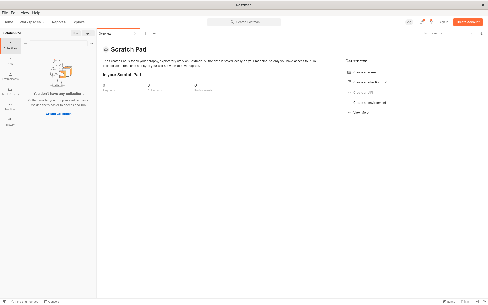
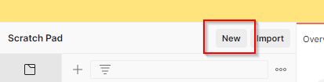

# Aufgabe 1 #
## a)

Um eine HTTP anfrage an einen Server zu stellen habe ich mich für das Tool Postman entschieden. 

Um in Postman eine HTTP "GET" anfrage zu erstellen, klicken wir auch "New", oben links

