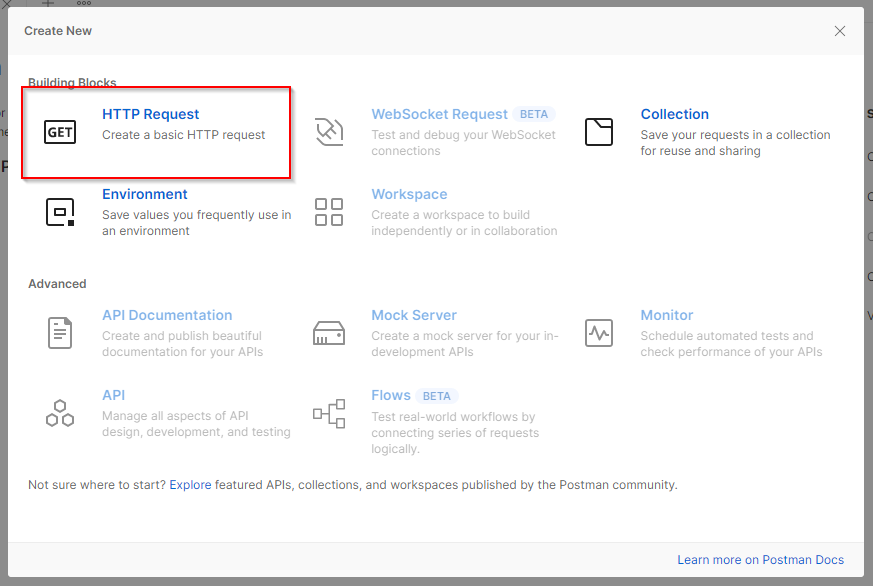
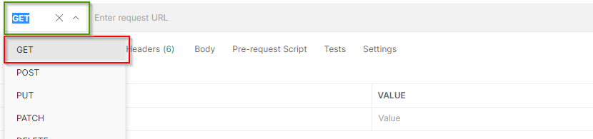
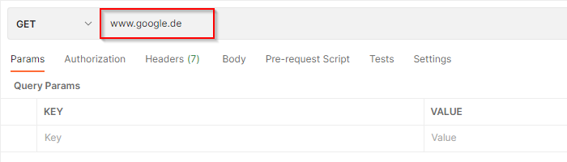
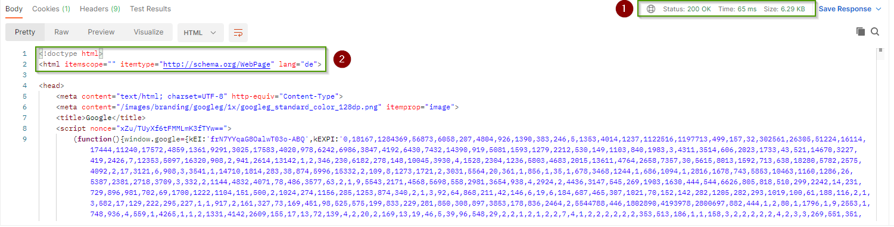
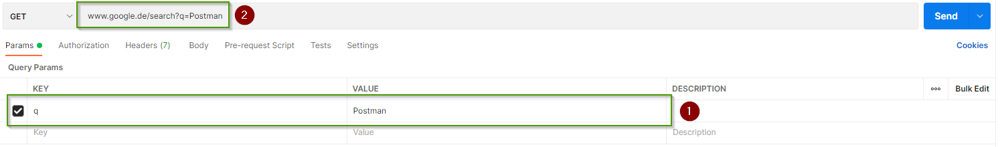

# Aufgabe 1 #
## a) ##

Um eine HTTP anfrage an einen Server zu stellen habe ich mich für das Tool Postman entschieden. 

  
*Postman Startseite*

Um in Postman eine HTTP "GET" anfrage zu erstellen, klicken wir auf "New", oben links

  
*Postman New Button*

Im sich nun geöffneten auswahl Dialog wählen wir "Http Request" aus.

  
*Postman Http Request auswählen*

Nun können wir Http Anfragen formulieren. Dafür wählen wir zuerst die Art der Anfrage aus ('GET', 'POST' 'PUT', etc.)  
Ich werde eine Get Anfrage formulieren. dazu wähle ich in aus dem Drop-down menü den Punkt 'GET' aus.

 
*Postman Get Anfragetypen auswählen*

Daraufhin geben wir die Adresse an, an welche wir die GET anfrage senden wollen. 
Dafür gebe ich im Eingabefeld neben der Typauswahl die URL 'www.google.de' ein. 

 
*Postman Anfrage URL eingeben*

Durch klicken des 'Send' Knopfes, rechts des eingabefeldes können wir die HTTP anfrage senden und sehen im unteren Bereich des Fensters die antwort des Servers.

 
*Postman Antwort auf die GET anfrage an Google*

Dabei werden uns einige Status informationen (1) angezeigt und der "Body" der Antwort welcher in diesem Fall aus einer HTML Datei besteht. (2)

***

Wir können der GET Anfrage auch einige Parameter mitgeben welche in der anfrage URL "codiert" werden.

Dafür verändern wir die URL von 'www.google.de' zu 'www.google.de/search' um eine spezifische suchanfrage auszuführen. Nun können wir im Tab 'Params', unterhalb des URL Inupt feldes, ein 'Key-Value Paar' definieren um Google einen Suchparameter zu übergeben. 

*Postman Suchparameter für eine Google Suche*

Wir haben den 'Key' 'q' und den 'Value' 'Postman' gewählt (1) und könne sehen, das Postman unsere URL entsprechend erweitert hat (2).

Nach klick des 'Send' Knopfes sehen wir wieder eine HTML daten und den Status Code '200 OK' wodruch wir wissen, dass unsere Anfrage korrekt verarbeitet wurde. 
  

***

## b) ##

Das HyperText Transfer Protokol (HTTP) definiert, dass eine HTTP anfrage immer aus einem Kopf (Head) und einem Körper (Body) bestehen muss.

### Head ###

Der Kopf binhaltet die Art der HTTP Anfrage (GET, PUT, POST) und informationen über den Inhalt der Anfrage und darüber was als rückgabe erwartet wird.  
Diese Daten werden, wie die Paramelter der URL in 'Key-Value Paaren' angegeben.

<table>
    <thead>
        <tr>
            <th>Beispiel Key</th>
            <th>Beispiel Value</th>
        </tr>
    </thead>
    <tbody>
        <tr>
            <td>Host</td>
            <td>www.google.de<td>
        </tr>
        <tr>
            <td>Accept</td>
            <td> */* (alles)</td>
        </tr>
        <tr>
            <td>Accept encoding</td>
            <td>gzip / deflate / br</td>
        </tr>
        <tr>
            <td>Connection</td>
            <td>Keep-alive / Close</td>
        </tr>
        <tr>
            <td> Content-Type </td>
            <td> text/html; charset=ISO-8859-1 </td>
        </tr>
        <tr>
            <td> Content-Encoding </td>
            <td> gzip </td>
        </tr>
        <tr>
            <td> ... </td>
            <td> ... </td>
        </tr>
    </tbody>
</table>

Zudem enthält der Head die Informationen darüber, was von der Website "verlangt" oder erwartet wird in form der URL. 

Die URL (Uniform Resource Locator) besteht aus 3 Teilen:
1. Dem Host 
    - Beispiel: www.google.de
2. Einem Pfad zur gewünschten Datei oder einer aktion auf der Website
    - Beispiel: /search 
3. Den Parametern als 'Key-Value Paar' 
    - Beispiel-Key: q 
    - Beispiel-Value: "Postman"

### Body ###

Der Body enthält den Payload, also die Daten die an den Server übermittelt werden sollen. 

### Funktionsweise von HTTP ###

Die Funktionsweise von HTTP werde ich anhand meines Beispiels von 'www.google.de/search?q=Postman' darstellen. 

Der Browser oder ein Tool wie zum Beispiel Postman wandeln die URL in eine HTTP anfrage nach dem oben genanntehn Schema um. 
Daraus ergibt sich der Host: 'www.google.de'. Um diese Anfrage korrekt verarbeiten zu können muss zuerst die Hostadresse zu einer konkrete adresse gewandelt werden. Dies geschieht über sogenannte DNS server, welche ein Telefonbuch des Internets sind.

Nun kann die HTTP anfrage an den Server gerichtet werden. 

Der Server interpretiert nun die Anfrage und sendet eine Response nachricht, welche dann vom Empfänger gelesen werden kann.

***

## c) ##

URL steht für Uniform Resource Locator, sprich eine einheitliche Art Resourcen (Datein) im Internet zu Lokalisieren. 
Der Aufbau einer URL wird an folgendem Beispiel erörtert.

Beispiel Wikipedia URL: https://de.wikipedia.org/wiki/Herborn#Geschichte

### Bestandteile ###

| Protokoll | Host              | Pfad          | Parameter | Anker         |
|:---------:|:-----------------:|:-------------:|:---------:|:-------------:|
| https     |de.wikipedia.org   |wiki/Herborn   | -/-       | #Geschichte   |

### Protokoll ###

HTTP / HTTPS steht für Hypertext Transfer Protokoll, welches üblicherweise zur übermittlung von Websiten verwendet wird. 
Moderne Browser sind jedoch auch dazu in der Lage Protokolle wie zum Beispiel 'mailto:' zu interpretieren und ein Mail Programm zu öffnen. 

### Host ###

Der Host ist der Bereitsteller der angeforderten Resource, also der Server auf dem die angeforderte Datei liegt. 

In diesem Beisiel der Deutschsprachige wikipedia Server.

### Pfad ###

Der Pfad definiert den genauen Ort der gewünschten Datei. 

In diesem Beispiel eine Date im Verzeichnis 'Wiki' mit dem Namen 'Herborn'

### Parameter ###

Parameter werden wie oben schon beschrieben in 'Key-Value Paaren' in der URL codiert und werden zur übergabe von Nutzer spezifischen Daten verwendet.

Zum Beispiel eines Suchparameters an Google.

### Anker ###

Anker sind in HTML festgelegte Punkte welche die Seite mit Logischen einstiegsstellen versehen können welche in URL's referenziert werden können.

Falls mich nun lediglich die Geschichte der Stadt Herborn interessiert wähle ich den Anker #Geschichte.

Anker müssen jedoch vom Website entwickler in Form einer HTML-Tag ID bereitgestellt werden. 

